# 🚀 Dipesh Girase

  

  

   

  
  
  

   
   

  <strong>📍 Surat, Gujarat, India</strong>

---

## 👋 Hello World

I'm **Dipesh Girase**, a passionate **Computer Science Engineering student** who enjoys building AI-powered applications, modern web platforms, and meaningful digital experiences. I like working where product thinking, clean engineering, and futuristic user experiences meet.

<table>
  <tr>
    <td valign="top" width="50%">
      <h3>Interests</h3>
      <ul>
        <li>Full Stack Development</li>
        <li>Artificial Intelligence</li>
        <li>Generative AI</li>
        <li>Prompt Engineering</li>
        <li>Product Building</li>
        <li>UI/UX Design</li>
        <li>Open Source</li>
      </ul>
    </td>
    <td valign="top" width="50%">
      <h3>Currently Learning</h3>
      <ul>
        <li>MERN Stack</li>
        <li>Advanced React</li>
        <li>Node.js</li>
        <li>System Design</li>
        <li>Large Language Models</li>
        <li>SaaS Development</li>
      </ul>
    </td>
  </tr>
</table>

---

## ⚡ 3D Developer Power Dashboard

  

  <h3>Developer Power Level: 87%</h3>

  <table>
    <tr>
      <td><strong>Frontend</strong></td>
      <td><code>█████████░</code></td>
      <td><strong>90%</strong></td>
    </tr>
    <tr>
      <td><strong>Backend</strong></td>
      <td><code>███████░░░</code></td>
      <td><strong>70%</strong></td>
    </tr>
    <tr>
      <td><strong>AI Engineering</strong></td>
      <td><code>████████░░</code></td>
      <td><strong>85%</strong></td>
    </tr>
    <tr>
      <td><strong>Problem Solving</strong></td>
      <td><code>████████░░</code></td>
      <td><strong>80%</strong></td>
    </tr>
    <tr>
      <td><strong>Communication</strong></td>
      <td><code>█████████░</code></td>
      <td><strong>90%</strong></td>
    </tr>
    <tr>
      <td><strong>Projects</strong></td>
      <td><code>████████░░</code></td>
      <td><strong>85%</strong></td>
    </tr>
  </table>

---

## 🧰 Tech Stack

### Frontend

### Backend

### Database

### Tools

### AI

---

## 🏆 Featured Projects

<table>
  <tr>
    <td width="50%">
      <h3>🍽️ Restaurant QR Menu Management System</h3>
      
<strong>Flagship Project</strong>

      
A full-stack restaurant management platform with QR-based menu access, admin dashboard, menu management, responsive UI, and real-time updates.

      

        
        
        
        
      

    </td>
    <td width="50%">
      <h3>🌦️ WeatherGenius AI</h3>
      
AI-powered weather platform providing intelligent forecasts, activity recommendations, and personalized insights.

      

        
        
        
      

    </td>
  </tr>
  <tr>
    <td width="50%">
      <h3>🧮 NeuroCalc Pro</h3>
      
Advanced analytical calculator with modern UI and high-speed calculations.

      

        
        
        
      

    </td>
    <td width="50%">
      <h3>🤖 BioGeneter</h3>
      
AI-powered bio and resume generator using prompt engineering and LLM workflows.

      

        
        
        
      

    </td>
  </tr>
  <tr>
    <td colspan="2">
      <h3>✨ Dipesh Portfolio</h3>
      
Apple-inspired developer portfolio with responsive design, modern branding, and a polished GitHub-first identity.

      

        
        
      

    </td>
  </tr>
</table>

---

## 🎓 Certifications

---

## 📈 GitHub Analytics

  
  

   
   

  
  

   
   

  

   
   

  

---

## 🗺️ Journey Timeline

| Year | Focus |
|---:|---|
| 2024 | Web Development |
| 2025 | AI & Prompt Engineering |
| 2025 | Full Stack Development |
| 2026 | Product Building & Hackathons |
| 2026 | Open Source & Advanced AI |

---

## 🎯 Current Goals

<table>
  <tr>
    <td>✅ Build AI Products</td>
    <td>✅ Contribute to Open Source</td>
  </tr>
  <tr>
    <td>✅ Secure Software Development Internship</td>
    <td>✅ Master MERN Stack</td>
  </tr>
  <tr>
    <td>✅ Learn System Design</td>
    <td>✅ Launch SaaS Products</td>
  </tr>
</table>

---

## 🌐 Connect With Me

  
  
  
  
  

   
   

  <strong>📍 Surat, Gujarat, India</strong>

---

## ⚡ Fun Facts

<table>
  <tr>
    <td>⚡ I love turning ideas into products</td>
    <td>🤖 Passionate about AI & emerging technologies</td>
  </tr>
  <tr>
    <td>🎤 Enjoy public speaking and teamwork</td>
    <td>📚 Always learning something new</td>
  </tr>
</table>

---

  

  <h3>Thanks for visiting ✨</h3>
  
<strong>Let's build software that feels fast, useful, and future-ready.</strong>

